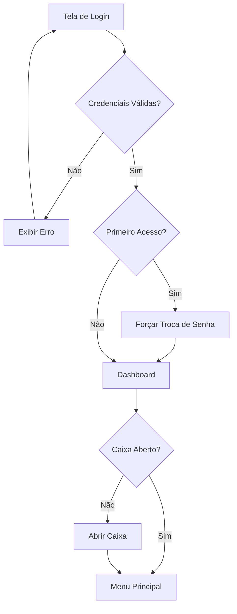
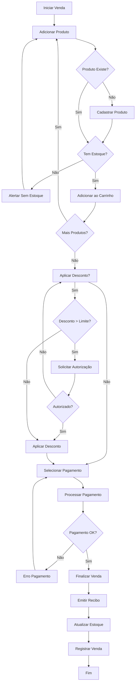
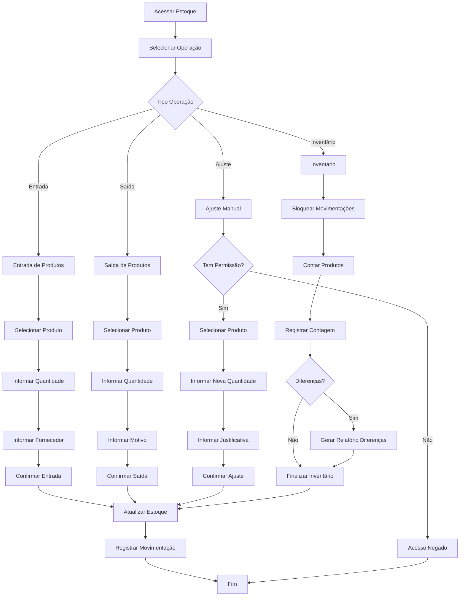
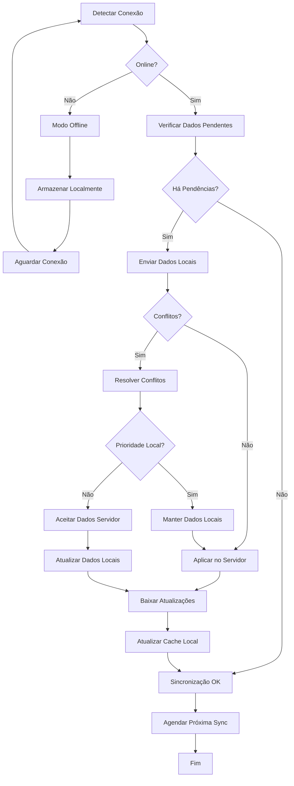
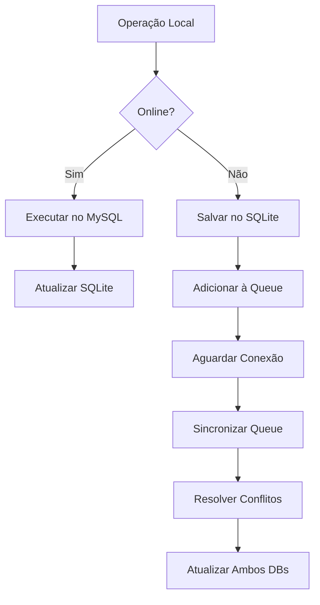

# PRD - Sistema de Controle de Estoque e PDV

## Visão Geral

Sistema completo para controle de estoque e ponto de venda (PDV) para loja física, com funcionamento online e offline, sincronização automática e interface amigável. O sistema deve ser uma Progressive Web App (PWA) que funciona tanto em dispositivos móveis quanto desktop.

## Objetivos do Projeto

- **Primário**: Facilitar o controle de estoque e vendas em tempo real
- **Secundário**: Reduzir perdas por falta de controle de estoque
- **Terciário**: Gerar relatórios para tomada de decisões estratégicas

## Funcionalidades Principais

### 1. Gestão de Produtos

- Cadastro completo de produtos (nome, descrição, categoria, preço, custo, código de barras)
- Upload de imagens dos produtos
- Controle de produtos ativos/inativos
- Histórico de alterações de preços
- Produtos com variações (tamanho, cor, etc.)

### 2. Controle de Estoque

- Entrada de produtos (compras, devoluções)
- Saída de produtos (vendas, perdas, transferências)
- Ajustes manuais de estoque com justificativa
- Inventário periódico
- Alertas de estoque baixo (configurável por produto)
- Controle de lotes e validade

### 3. PDV (Ponto de Venda)

- Interface otimizada para vendas rápidas
- Leitura de código de barras
- Aplicação de descontos (percentual ou valor fixo)
- Múltiplas formas de pagamento (dinheiro, cartão, PIX)
- Emissão de recibos/cupons
- Controle de caixa (abertura, fechamento, sangria)
- Vendas parceladas

### 4. Gestão de Clientes

- Cadastro completo de clientes
- Histórico de compras
- Programa de fidelidade (pontos)
- Vendas a prazo/crediário

### 5. Relatórios e Analytics

- Relatório de vendas (diário, semanal, mensal)
- Relatório de estoque (atual, movimentações)
- Relatório financeiro (faturamento, lucro)
- Produtos mais vendidos
- Análise de performance por vendedor
- Exportação em PDF/Excel

### 6. Gestão de Usuários

- Diferentes níveis de acesso (Admin, Gerente, Operador)
- Log de atividades dos usuários
- Controle de permissões granular

### 7. Funcionalidades Offline

- Funcionamento completo offline (PWA)
- Sincronização automática quando online
- Resolução de conflitos de dados
- Backup local automático

## Regras de Negócio Detalhadas

### Estoque

- **RN001**: Não permitir venda de produtos com estoque zerado (configurável)
- **RN002**: Ajustes de estoque só podem ser feitos por usuários com permissão
- **RN003**: Toda movimentação de estoque deve ser registrada com usuário e timestamp
- **RN004**: Produtos com estoque baixo devem gerar alertas automáticos
- **RN005**: Inventário deve bloquear movimentações durante sua execução

### Vendas

- **RN006**: Toda venda deve gerar um recibo único e sequencial
- **RN007**: Vendas devem atualizar o estoque automaticamente
- **RN008**: Descontos acima de X% precisam de autorização superior
- **RN009**: Vendas canceladas devem restaurar o estoque
- **RN010**: Não permitir vendas com valor negativo

### Financeiro

- **RN011**: Caixa deve ser aberto antes de iniciar vendas
- **RN012**: Fechamento de caixa deve conferir valores físico vs sistema
- **RN013**: Sangrias devem ser registradas com justificativa
- **RN014**: Vendas a prazo só para clientes cadastrados

### Sincronização

- **RN015**: Dados offline têm prioridade em caso de conflito
- **RN016**: Sincronização deve ser incremental para otimizar performance
- **RN017**: Falhas de sincronização devem ser logadas e notificadas

### Segurança

- **RN018**: Senhas devem ter no mínimo 8 caracteres
- **RN019**: Sessões expiram após X minutos de inatividade
- **RN020**: Backup automático diário dos dados críticos

## Casos de Uso Principais

### UC001 - Realizar Venda

**Ator**: Operador de Caixa
**Pré-condições**: Usuário logado, caixa aberto
**Fluxo Principal**:

1. Operador acessa PDV
2. Adiciona produtos (código de barras ou busca)
3. Aplica descontos se necessário
4. Seleciona forma de pagamento
5. Finaliza venda
6. Emite recibo
7. Atualiza estoque automaticamente

### UC002 - Controlar Estoque

**Ator**: Gerente de Estoque
**Pré-condições**: Usuário com permissão logado
**Fluxo Principal**:

1. Acessa módulo de estoque
2. Seleciona tipo de movimentação (entrada/saída/ajuste)
3. Informa produto e quantidade
4. Adiciona justificativa (se ajuste)
5. Confirma movimentação
6. Sistema registra no histórico

### UC003 - Gerar Relatórios

**Ator**: Gerente/Admin
**Pré-condições**: Usuário com permissão logado
**Fluxo Principal**:

1. Acessa módulo de relatórios
2. Seleciona tipo de relatório
3. Define período e filtros
4. Gera relatório
5. Visualiza ou exporta (PDF/Excel)

## Fluxos Detalhados (Flowcharts)

### Fluxo de Login e Autenticação



### Fluxo de Vendas (PDV)



### Fluxo de Controle de Estoque



### Fluxo de Sincronização



## Schema do Banco de Dados Completo

### 1. Tabela: users

```sql
CREATE TABLE users (
    id UUID PRIMARY KEY DEFAULT gen_random_uuid(),
    name VARCHAR(100) NOT NULL,
    email VARCHAR(150) UNIQUE NOT NULL,
    password_hash VARCHAR(255) NOT NULL,
    role VARCHAR(20) NOT NULL CHECK (role IN ('admin', 'manager', 'operator')),
    is_active BOOLEAN DEFAULT true,
    first_login BOOLEAN DEFAULT true,
    last_login TIMESTAMP,
    created_at TIMESTAMP DEFAULT CURRENT_TIMESTAMP,
    updated_at TIMESTAMP DEFAULT CURRENT_TIMESTAMP
);

CREATE INDEX idx_users_email ON users(email);
CREATE INDEX idx_users_role ON users(role);
```

### 2. Tabela: categories

```sql
CREATE TABLE categories (
    id UUID PRIMARY KEY DEFAULT gen_random_uuid(),
    name VARCHAR(100) NOT NULL UNIQUE,
    description TEXT,
    is_active BOOLEAN DEFAULT true,
    created_at TIMESTAMP DEFAULT CURRENT_TIMESTAMP,
    updated_at TIMESTAMP DEFAULT CURRENT_TIMESTAMP
);

CREATE INDEX idx_categories_name ON categories(name);
```

### 3. Tabela: suppliers

```sql
CREATE TABLE suppliers (
    id UUID PRIMARY KEY DEFAULT gen_random_uuid(),
    name VARCHAR(150) NOT NULL,
    document VARCHAR(20) UNIQUE,
    email VARCHAR(150),
    phone VARCHAR(20),
    address TEXT,
    is_active BOOLEAN DEFAULT true,
    created_at TIMESTAMP DEFAULT CURRENT_TIMESTAMP,
    updated_at TIMESTAMP DEFAULT CURRENT_TIMESTAMP
);

CREATE INDEX idx_suppliers_name ON suppliers(name);
CREATE INDEX idx_suppliers_document ON suppliers(document);
```

### 4. Tabela: products

```sql
CREATE TABLE products (
    id UUID PRIMARY KEY DEFAULT gen_random_uuid(),
    name VARCHAR(200) NOT NULL,
    description TEXT,
    category_id UUID REFERENCES categories(id),
    supplier_id UUID REFERENCES suppliers(id),
    barcode VARCHAR(50) UNIQUE,
    sku VARCHAR(50) UNIQUE,
    cost_price DECIMAL(10,2) NOT NULL DEFAULT 0,
    sale_price DECIMAL(10,2) NOT NULL DEFAULT 0,
    current_stock INTEGER NOT NULL DEFAULT 0,
    min_stock INTEGER DEFAULT 0,
    max_stock INTEGER,
    unit VARCHAR(10) DEFAULT 'UN',
    image_url TEXT,
    is_active BOOLEAN DEFAULT true,
    created_at TIMESTAMP DEFAULT CURRENT_TIMESTAMP,
    updated_at TIMESTAMP DEFAULT CURRENT_TIMESTAMP
);

CREATE INDEX idx_products_name ON products(name);
CREATE INDEX idx_products_barcode ON products(barcode);
CREATE INDEX idx_products_sku ON products(sku);
CREATE INDEX idx_products_category ON products(category_id);
CREATE INDEX idx_products_stock ON products(current_stock);
```

### 5. Tabela: customers

```sql
CREATE TABLE customers (
    id UUID PRIMARY KEY DEFAULT gen_random_uuid(),
    name VARCHAR(150) NOT NULL,
    document VARCHAR(20) UNIQUE,
    email VARCHAR(150),
    phone VARCHAR(20),
    address TEXT,
    birth_date DATE,
    loyalty_points INTEGER DEFAULT 0,
    is_active BOOLEAN DEFAULT true,
    created_at TIMESTAMP DEFAULT CURRENT_TIMESTAMP,
    updated_at TIMESTAMP DEFAULT CURRENT_TIMESTAMP
);

CREATE INDEX idx_customers_name ON customers(name);
CREATE INDEX idx_customers_document ON customers(document);
CREATE INDEX idx_customers_phone ON customers(phone);
```

### 6. Tabela: cash_registers

```sql
CREATE TABLE cash_registers (
    id UUID PRIMARY KEY DEFAULT gen_random_uuid(),
    user_id UUID NOT NULL REFERENCES users(id),
    opening_amount DECIMAL(10,2) NOT NULL DEFAULT 0,
    closing_amount DECIMAL(10,2),
    expected_amount DECIMAL(10,2),
    difference DECIMAL(10,2),
    opened_at TIMESTAMP DEFAULT CURRENT_TIMESTAMP,
    closed_at TIMESTAMP,
    status VARCHAR(20) DEFAULT 'open' CHECK (status IN ('open', 'closed'))
);

CREATE INDEX idx_cash_registers_user ON cash_registers(user_id);
CREATE INDEX idx_cash_registers_status ON cash_registers(status);
CREATE INDEX idx_cash_registers_date ON cash_registers(opened_at);
```

### 7. Tabela: sales

```sql
CREATE TABLE sales (
    id UUID PRIMARY KEY DEFAULT gen_random_uuid(),
    sale_number VARCHAR(20) UNIQUE NOT NULL,
    user_id UUID NOT NULL REFERENCES users(id),
    customer_id UUID REFERENCES customers(id),
    cash_register_id UUID REFERENCES cash_registers(id),
    subtotal DECIMAL(10,2) NOT NULL DEFAULT 0,
    discount_amount DECIMAL(10,2) DEFAULT 0,
    discount_percentage DECIMAL(5,2) DEFAULT 0,
    total_amount DECIMAL(10,2) NOT NULL DEFAULT 0,
    payment_method VARCHAR(20) NOT NULL CHECK (payment_method IN ('cash', 'card', 'pix', 'credit')),
    installments INTEGER DEFAULT 1,
    status VARCHAR(20) DEFAULT 'completed' CHECK (status IN ('pending', 'completed', 'cancelled')),
    notes TEXT,
    created_at TIMESTAMP DEFAULT CURRENT_TIMESTAMP,
    updated_at TIMESTAMP DEFAULT CURRENT_TIMESTAMP
);

CREATE INDEX idx_sales_number ON sales(sale_number);
CREATE INDEX idx_sales_user ON sales(user_id);
CREATE INDEX idx_sales_customer ON sales(customer_id);
CREATE INDEX idx_sales_date ON sales(created_at);
CREATE INDEX idx_sales_status ON sales(status);
```

### 8. Tabela: sale_items

```sql
CREATE TABLE sale_items (
    id UUID PRIMARY KEY DEFAULT gen_random_uuid(),
    sale_id UUID NOT NULL REFERENCES sales(id) ON DELETE CASCADE,
    product_id UUID NOT NULL REFERENCES products(id),
    quantity INTEGER NOT NULL CHECK (quantity > 0),
    unit_price DECIMAL(10,2) NOT NULL,
    total_price DECIMAL(10,2) NOT NULL,
    discount_amount DECIMAL(10,2) DEFAULT 0,
    created_at TIMESTAMP DEFAULT CURRENT_TIMESTAMP
);

CREATE INDEX idx_sale_items_sale ON sale_items(sale_id);
CREATE INDEX idx_sale_items_product ON sale_items(product_id);
```

### 9. Tabela: stock_movements

```sql
CREATE TABLE stock_movements (
    id UUID PRIMARY KEY DEFAULT gen_random_uuid(),
    product_id UUID NOT NULL REFERENCES products(id),
    user_id UUID NOT NULL REFERENCES users(id),
    movement_type VARCHAR(20) NOT NULL CHECK (movement_type IN ('in', 'out', 'adjustment', 'inventory')),
    quantity INTEGER NOT NULL,
    previous_stock INTEGER NOT NULL,
    new_stock INTEGER NOT NULL,
    unit_cost DECIMAL(10,2),
    reference_id UUID, -- ID da venda, compra, etc.
    reference_type VARCHAR(20), -- 'sale', 'purchase', 'adjustment', etc.
    reason TEXT,
    created_at TIMESTAMP DEFAULT CURRENT_TIMESTAMP
);

CREATE INDEX idx_stock_movements_product ON stock_movements(product_id);
CREATE INDEX idx_stock_movements_user ON stock_movements(user_id);
CREATE INDEX idx_stock_movements_type ON stock_movements(movement_type);
CREATE INDEX idx_stock_movements_date ON stock_movements(created_at);
CREATE INDEX idx_stock_movements_reference ON stock_movements(reference_id, reference_type);
```

### 10. Tabela: price_history

```sql
CREATE TABLE price_history (
    id UUID PRIMARY KEY DEFAULT gen_random_uuid(),
    product_id UUID NOT NULL REFERENCES products(id),
    user_id UUID NOT NULL REFERENCES users(id),
    old_cost_price DECIMAL(10,2),
    new_cost_price DECIMAL(10,2),
    old_sale_price DECIMAL(10,2),
    new_sale_price DECIMAL(10,2),
    reason TEXT,
    created_at TIMESTAMP DEFAULT CURRENT_TIMESTAMP
);

CREATE INDEX idx_price_history_product ON price_history(product_id);
CREATE INDEX idx_price_history_date ON price_history(created_at);
```

### 11. Tabela: inventory_sessions

```sql
CREATE TABLE inventory_sessions (
    id UUID PRIMARY KEY DEFAULT gen_random_uuid(),
    user_id UUID NOT NULL REFERENCES users(id),
    name VARCHAR(100) NOT NULL,
    status VARCHAR(20) DEFAULT 'active' CHECK (status IN ('active', 'completed', 'cancelled')),
    started_at TIMESTAMP DEFAULT CURRENT_TIMESTAMP,
    completed_at TIMESTAMP
);

CREATE INDEX idx_inventory_sessions_user ON inventory_sessions(user_id);
CREATE INDEX idx_inventory_sessions_status ON inventory_sessions(status);
```

### 12. Tabela: inventory_items

```sql
CREATE TABLE inventory_items (
    id UUID PRIMARY KEY DEFAULT gen_random_uuid(),
    inventory_session_id UUID NOT NULL REFERENCES inventory_sessions(id) ON DELETE CASCADE,
    product_id UUID NOT NULL REFERENCES products(id),
    system_stock INTEGER NOT NULL,
    counted_stock INTEGER,
    difference INTEGER,
    notes TEXT,
    counted_at TIMESTAMP,
    created_at TIMESTAMP DEFAULT CURRENT_TIMESTAMP
);

CREATE INDEX idx_inventory_items_session ON inventory_items(inventory_session_id);
CREATE INDEX idx_inventory_items_product ON inventory_items(product_id);
```

### 13. Tabela: sync_queue

```sql
CREATE TABLE sync_queue (
    id UUID PRIMARY KEY DEFAULT gen_random_uuid(),
    table_name VARCHAR(50) NOT NULL,
    record_id UUID NOT NULL,
    operation VARCHAR(10) NOT NULL CHECK (operation IN ('INSERT', 'UPDATE', 'DELETE')),
    data JSONB,
    status VARCHAR(20) DEFAULT 'pending' CHECK (status IN ('pending', 'synced', 'error')),
    error_message TEXT,
    attempts INTEGER DEFAULT 0,
    created_at TIMESTAMP DEFAULT CURRENT_TIMESTAMP,
    synced_at TIMESTAMP
);

CREATE INDEX idx_sync_queue_status ON sync_queue(status);
CREATE INDEX idx_sync_queue_table ON sync_queue(table_name);
CREATE INDEX idx_sync_queue_created ON sync_queue(created_at);
```

### 14. Tabela: user_sessions

```sql
CREATE TABLE user_sessions (
    id UUID PRIMARY KEY DEFAULT gen_random_uuid(),
    user_id UUID NOT NULL REFERENCES users(id),
    token VARCHAR(255) NOT NULL UNIQUE,
    expires_at TIMESTAMP NOT NULL,
    created_at TIMESTAMP DEFAULT CURRENT_TIMESTAMP,
    last_activity TIMESTAMP DEFAULT CURRENT_TIMESTAMP
);

CREATE INDEX idx_user_sessions_user ON user_sessions(user_id);
CREATE INDEX idx_user_sessions_token ON user_sessions(token);
CREATE INDEX idx_user_sessions_expires ON user_sessions(expires_at);
```

### 15. Tabela: audit_logs

```sql
CREATE TABLE audit_logs (
    id UUID PRIMARY KEY DEFAULT gen_random_uuid(),
    user_id UUID REFERENCES users(id),
    action VARCHAR(50) NOT NULL,
    table_name VARCHAR(50),
    record_id UUID,
    old_values JSONB,
    new_values JSONB,
    ip_address INET,
    user_agent TEXT,
    created_at TIMESTAMP DEFAULT CURRENT_TIMESTAMP
);

CREATE INDEX idx_audit_logs_user ON audit_logs(user_id);
CREATE INDEX idx_audit_logs_action ON audit_logs(action);
CREATE INDEX idx_audit_logs_table ON audit_logs(table_name);
CREATE INDEX idx_audit_logs_date ON audit_logs(created_at);
```

## Relacionamentos e Constraints Adicionais

### Triggers para Auditoria

```sql
-- Trigger para atualizar updated_at automaticamente
CREATE OR REPLACE FUNCTION update_updated_at_column()
RETURNS TRIGGER AS $$
BEGIN
    NEW.updated_at = CURRENT_TIMESTAMP;
    RETURN NEW;
END;
$$ language 'plpgsql';

-- Aplicar trigger em todas as tabelas relevantes
CREATE TRIGGER update_users_updated_at BEFORE UPDATE ON users FOR EACH ROW EXECUTE FUNCTION update_updated_at_column();
CREATE TRIGGER update_products_updated_at BEFORE UPDATE ON products FOR EACH ROW EXECUTE FUNCTION update_updated_at_column();
CREATE TRIGGER update_categories_updated_at BEFORE UPDATE ON categories FOR EACH ROW EXECUTE FUNCTION update_updated_at_column();
CREATE TRIGGER update_suppliers_updated_at BEFORE UPDATE ON suppliers FOR EACH ROW EXECUTE FUNCTION update_updated_at_column();
CREATE TRIGGER update_customers_updated_at BEFORE UPDATE ON customers FOR EACH ROW EXECUTE FUNCTION update_updated_at_column();
CREATE TRIGGER update_sales_updated_at BEFORE UPDATE ON sales FOR EACH ROW EXECUTE FUNCTION update_updated_at_column();
```

### Views Úteis

```sql
-- View para produtos com estoque baixo
CREATE VIEW low_stock_products AS
SELECT
    p.id,
    p.name,
    p.current_stock,
    p.min_stock,
    c.name as category_name
FROM products p
LEFT JOIN categories c ON p.category_id = c.id
WHERE p.current_stock <= p.min_stock AND p.is_active = true;

-- View para relatório de vendas diárias
CREATE VIEW daily_sales_report AS
SELECT
    DATE(s.created_at) as sale_date,
    COUNT(*) as total_sales,
    SUM(s.total_amount) as total_revenue,
    AVG(s.total_amount) as average_sale,
    u.name as seller_name
FROM sales s
JOIN users u ON s.user_id = u.id
WHERE s.status = 'completed'
GROUP BY DATE(s.created_at), u.id, u.name
ORDER BY sale_date DESC;
```

---

## Tecnologias Recomendadas

### Backend

- **Framework**: Node.js com Express ou Fastify
- **Banco de Dados**: MySQL (produção) + SQLite (offline)
- **ORM**: Prisma
- **Autenticação**: NextAuth.js + JWT
- **Validação**: Zod
- **Cache**: Redis (opcional)

### Frontend

- **Framework**: Next.js 14+ com TypeScript
- **UI Framework**: ShadcnUI + TailwindCSS
- **Estado**: Zustand
- **PWA**: Workbox
- **Offline Storage**: SQLite (via Prisma) + IndexedDB
- **Formulários**: React Hook Form + Zod
- **Testes**: Jest + React Testing Library
- **Documentação**: Storybook

### Infraestrutura

- **Deploy**: Vercel (frontend + backend)
- **Banco de Dados**: PlanetScale (MySQL) ou Railway
- **Monitoramento**: Sentry + Vercel Analytics
- **Backup**: Automated MySQL backups
- **CDN**: Vercel Edge Network

## Arquitetura Offline/Online

### Estratégia de Dados Híbrida

#### Online (Produção)

- **Banco Principal**: MySQL hospedado (PlanetScale/Railway)
- **Cache**: Redis para sessões e dados frequentes
- **Sincronização**: Real-time via WebSockets
- **Backup**: Automático diário

#### Offline (Local)

- **Banco Local**: SQLite via Prisma
- **Storage**: IndexedDB para assets e cache
- **Queue**: Fila de sincronização para operações pendentes
- **Conflict Resolution**: Timestamp-based com prioridade local

### Fluxo de Sincronização



### Componentes de Sincronização

#### 1. SyncManager

- Gerencia fila de sincronização
- Detecta conflitos de dados
- Implementa retry logic
- Monitora status de conexão

#### 2. ConflictResolver

- Estratégias de resolução:
  - **Last Write Wins**: Para dados não críticos
  - **Manual Resolution**: Para vendas e estoque
  - **Merge Strategy**: Para configurações

#### 3. OfflineQueue

- Armazena operações pendentes
- Prioriza operações críticas
- Implementa exponential backoff
- Persiste entre sessões

### Schema Adaptado para Offline

#### Tabelas Críticas (Sempre Sincronizadas)

- `products` - Catálogo de produtos
- `stock_movements` - Movimentações de estoque
- `sales` - Vendas realizadas
- `customers` - Dados de clientes

#### Tabelas de Cache (Sincronização Opcional)

- `categories` - Categorias de produtos
- `suppliers` - Fornecedores
- `price_history` - Histórico de preços

#### Metadados de Sincronização

```sql
-- Adicionar a todas as tabelas críticas
ALTER TABLE products ADD COLUMN sync_status VARCHAR(20) DEFAULT 'synced';
ALTER TABLE products ADD COLUMN last_sync TIMESTAMP DEFAULT CURRENT_TIMESTAMP;
ALTER TABLE products ADD COLUMN conflict_data JSONB;
```

---

Este documento fornece uma base sólida para o desenvolvimento do sistema de controle de estoque e PDV, com schema de banco robusto, fluxos detalhados, regras de negócio bem definidas e arquitetura híbrida offline/online.
