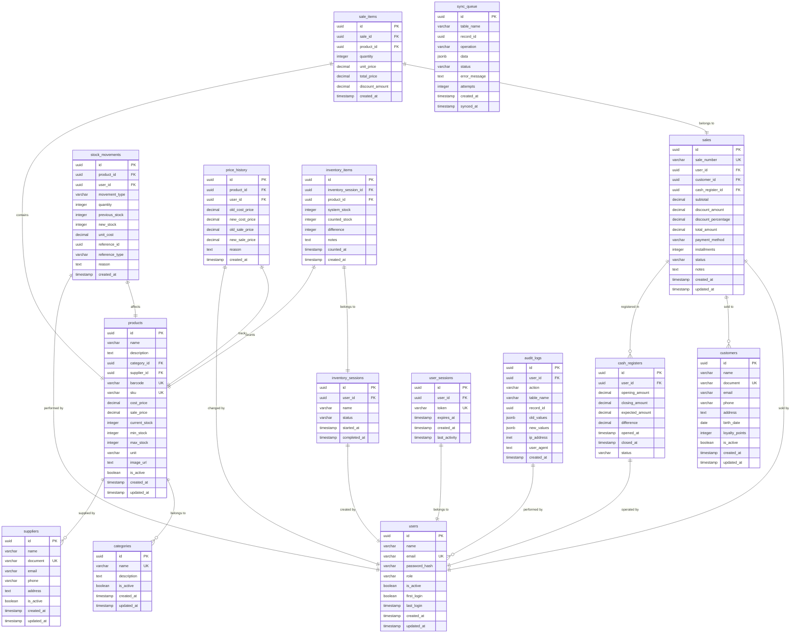

# Diagrama Entidade-Relacionamento (ER)

## Diagrama ER do Sistema de Controle de Estoque e PDV

## Índices Principais por Tabela

### Índices de Performance
- **users**: email, role
- **products**: name, barcode, sku, category_id, current_stock
- **sales**: sale_number, user_id, customer_id, created_at, status
- **sale_items**: sale_id, product_id
- **stock_movements**: product_id, user_id, movement_type, created_at
- **cash_registers**: user_id, status, opened_at

### Índices de Busca
- **customers**: name, document, phone
- **suppliers**: name, document
- **categories**: name
- **sync_queue**: status, table_name, created_at
- **audit_logs**: user_id, action, table_name, created_at

## Constraints e Validações

### Check Constraints
- **users.role**: IN ('admin', 'manager', 'operator')
- **sales.payment_method**: IN ('cash', 'card', 'pix', 'credit')
- **sales.status**: IN ('pending', 'completed', 'cancelled')
- **stock_movements.movement_type**: IN ('in', 'out', 'adjustment', 'inventory')
- **cash_registers.status**: IN ('open', 'closed')
- **inventory_sessions.status**: IN ('active', 'completed', 'cancelled')
- **sync_queue.operation**: IN ('INSERT', 'UPDATE', 'DELETE')
- **sync_queue.status**: IN ('pending', 'synced', 'error')
- **sale_items.quantity**: > 0

### Foreign Key Constraints
- Todas as referências FK com ON DELETE apropriado
- CASCADE para itens dependentes (sale_items, inventory_items)
- RESTRICT para entidades principais (products, users)

### Unique Constraints
- **users**: email
- **products**: barcode, sku
- **customers**: document
- **suppliers**: document
- **categories**: name
- **sales**: sale_number
- **user_sessions**: token

## Triggers Automáticos

### Update Timestamps
- Trigger `update_updated_at_column()` em todas as tabelas com campo `updated_at`

### Auditoria Automática
- Logs automáticos de alterações em tabelas críticas
- Registro de IP e User-Agent para rastreabilidade

### Validações de Negócio
- Validação de estoque antes de vendas
- Atualização automática de estoque após vendas
- Cálculo automático de diferenças em inventários
